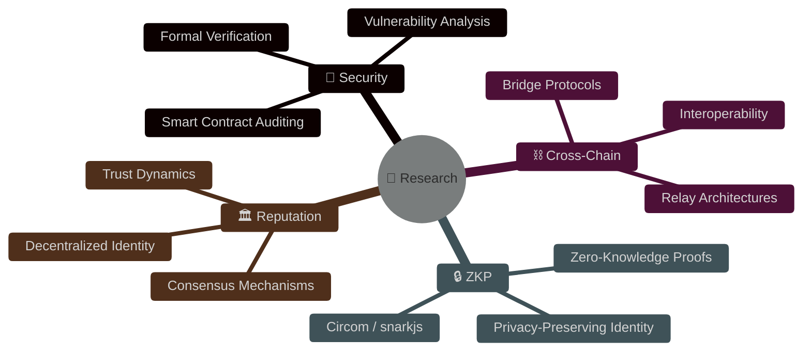

<div align="center">

<!-- HEADER -->


<!-- TYPING SVG -->
<a href="https://git.io/typing-svg">
  
</a>

<br/>

<!-- SOCIAL BADGES -->
<a href="https://orcid.org/0009-0008-8773-0482">
  
</a>
<a href="https://www.facebook.com/baolodc2005">
  
</a>
<a href="https://github.com/hpgbao2204">
  
</a>

<br/><br/>


</div>

---

<!-- ABOUT ME -->


## `> cat about_me.txt`

```yaml
name: Bao Huynh (Huynh Phan Gia Bao)
born: 2005
location: Ho Chi Minh City, Vietnam
university: University of Information Technology (UIT - VNUHCM)
role: Blockchain Security Researcher
focus:
  - Smart Contract Security & Auditing
  - Zero-Knowledge Proofs (ZKP)
  - Cross-Chain Interoperability
  - Decentralized Reputation Systems
motto: "In code we trust, but verify everything."
```

<br clear="both"/>

---

<!-- RESEARCH PUBLICATIONS -->
## `> cat publications.bib` 

<table>
<tr>
<td>🏆</td>
<td>

**ChronosRep: Entropy-regularized evidence fusion and stochastic differential trust dynamics for decentralized identity intelligence**
<br/><sub>📰 <b>Information Sciences</b> · Jun 2026 · <a href="https://doi.org/10.1016/j.ins.2026.123323">DOI: 10.1016/j.ins.2026.123323</a></sub>
<br/><sub>👥 Tuan-Dung Tran, <b>Bao Huynh</b>, Van-Hau Pham</sub>

</td>
</tr>
<tr>
<td>⛓️</td>
<td>

**Acheron: A market-based multi-relay architecture for adaptive and secure cross-chain communication**
<br/><sub>📰 <b>Internet of Things (Elsevier)</b> · Jan 2026 · <a href="https://doi.org/10.1016/j.iot.2025.101836">DOI: 10.1016/j.iot.2025.101836</a></sub>
<br/><sub>👥 Tuan-Dung Tran, Quang Vu, <b>Bao Huynh</b>, Van-Hau Pham</sub>

</td>
</tr>
<tr>
<td>🗳️</td>
<td>

**Proof-of-Merit: A Reputation-Weighted VRF-PoA Consensus and Governance for Educational Blockchains**
<br/><sub>📰 <b>RIVF 2025</b> (IEEE) · Dec 2025 · <a href="https://doi.org/10.1109/rivf68649.2025.11365043">DOI: 10.1109/rivf68649.2025.11365043</a></sub>
<br/><sub>👥 Tuan-Dung Tran, <b>Bao Huynh</b>, Tra Minh Trong, Tong Thuan Nguyen, Ngan Nguyen B.K, Van-Hau Pham</sub>

</td>
</tr>
<tr>
<td>🎓</td>
<td>

**DAVE-CC: A decentralized, access-controlled, verifiable ecosystem for cross-chain academic credential management**
<br/><sub>📰 <b>Journal of Information Security and Applications (Elsevier)</b> · Nov 2025 · <a href="https://doi.org/10.1016/j.jisa.2025.104238">DOI: 10.1016/j.jisa.2025.104238</a></sub>
<br/><sub>👥 Tuan-Dung Tran, <b>Huynh Phan Gia Bao</b>, Nguyen Tan Cam, Van-Hau Pham</sub>

</td>
</tr>
<tr>
<td>🔐</td>
<td>

**Lotus: A Hybrid Cross-Chain Framework for Privacy-Preserving Digital Identity**
<br/><sub>📰 <b>ISCIT 2025</b> (IEEE) · Oct 2025 · <a href="https://doi.org/10.1109/iscit67082.2025.11231625">DOI: 10.1109/iscit67082.2025.11231625</a></sub>
<br/><sub>👥 Tuan-Dung Tran, <b>Huynh Phan Gia Bao</b>, Tra Minh Trong, Nguyen Tan Cam, Van-Hau Pham</sub>

</td>
</tr>
</table>

---

<!-- TECH STACK -->
## `> ls ~/tech_stack/`

<div align="center">

### ⛓️ Blockchain & Web3
<p>


</p>

### 💻 Languages & Tools
<p>


</p>

</div>

---

<!-- RESEARCH INTERESTS GRAPH -->
## `> cat research_map.md`



---

<!-- GITHUB STATS -->
## `> neofetch --github`

<div align="center">

<a href="https://github.com/hpgbao2204">
  
  
</a>

<br/>

<a href="https://github.com/hpgbao2204">
  
</a>

<br/>

<!-- ACTIVITY GRAPH -->
<a href="https://github.com/hpgbao2204">
  
</a>

</div>

---

<!-- TROPHIES -->
## `> ls ~/achievements/`

<div align="center">
<a href="https://github.com/ryo-ma/github-profile-trophy">
  
</a>
</div>

---

<!-- METRICS -->
<div align="center">

### `> uptime`

```text
🎂 Born: 2005           🎓 University: UIT (VNUHCM)
📄 Publications: 5       🔬 Focus: Blockchain Security
⛓️ Ecosystems: 5+       🛡️ Audits: Smart Contracts
```

</div>

---

<!-- SNAKE ANIMATION -->
<div align="center">
<picture>
  <source media="(prefers-color-scheme: dark)" srcset="https://raw.githubusercontent.com/platane/snk/output/github-contribution-grid-snake-dark.svg" />
  <source media="(prefers-color-scheme: light)" srcset="https://raw.githubusercontent.com/platane/snk/output/github-contribution-grid-snake.svg" />
  
</picture>
</div>

---

<div align="center">

<!-- QUOTE -->


<br/><br/>

<!-- FOOTER -->


</div>
