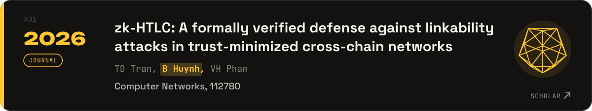
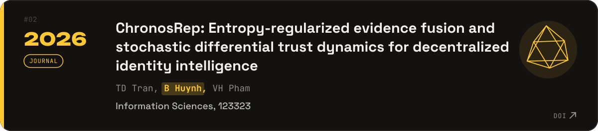
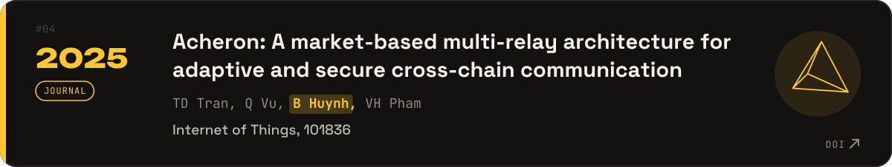
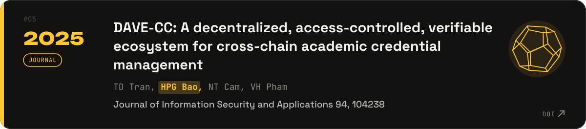
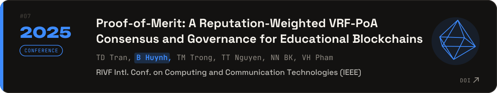
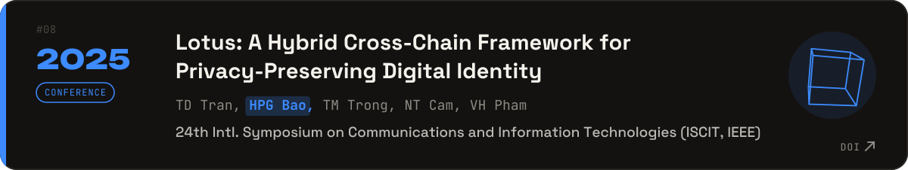
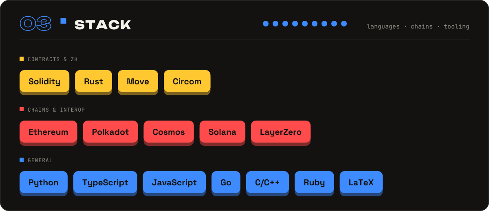

<!-- Generated by scripts/build.py from scripts/content.py - edit those, not this file. -->

 

  
  
  
  

 

  

Full list and citations on <a href="https://scholar.google.com/citations?user=koh0HscAAAAJ">Google Scholar</a>.

  

  

  

